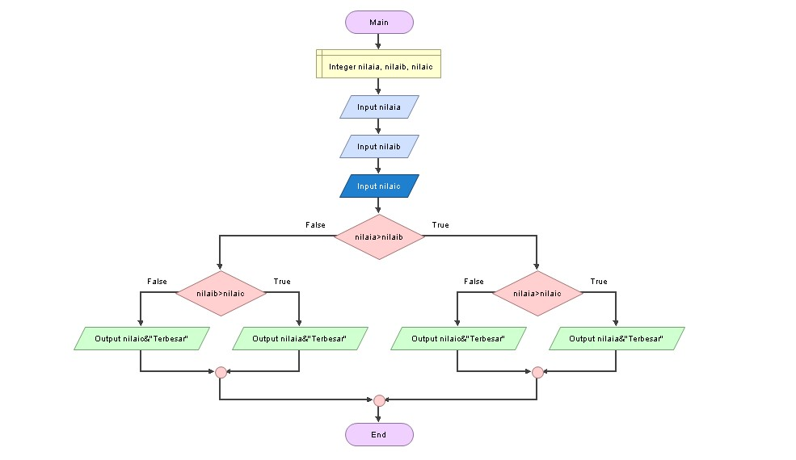

# labpy2
## Algoritma untuk menentukan nilai terbesar dari 3 buah bilangan 
ini adalah tampilan program dan hasil menentukan nilai terbesar dari 3 buah bilangan 

### Berikut adalah flowchart 
ini adalah tampilannya 
