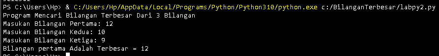
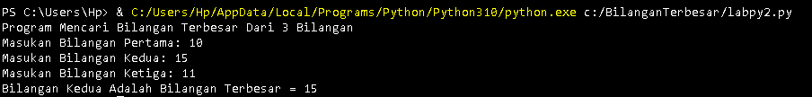
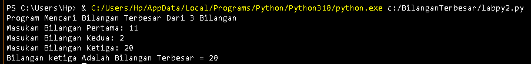
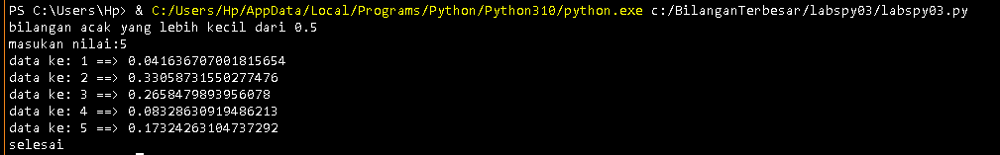
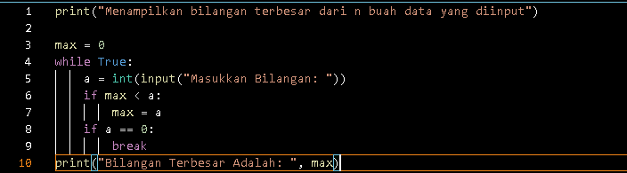
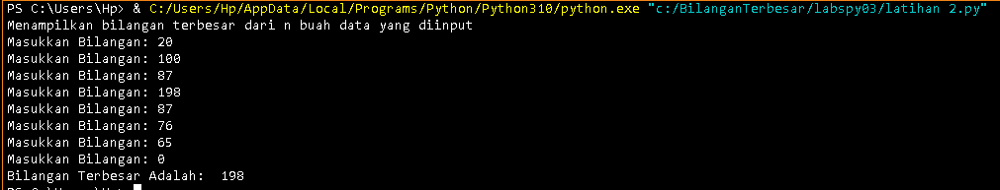
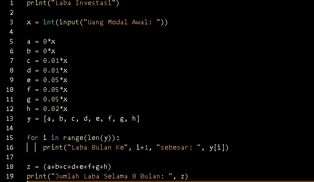
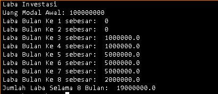

# labpy2
## Algoritma untuk menentukan nilai terbesar dari 3 buah bilangan 
### Menggunakan statement if untuk mencari nilai terbesar dari 3 bilangan
untuk a di inisiasikan sebagai bilangan pertama, b untuk bilangan kedua, c untuk bilangan ketiga

dengan cara statement if untuk a sebagai bilangan pertama, elif untuk b bilangan kedua, dan else untuk c bilangan ketiga, berikut gambar program dan tulisan programnya
ini adalah tampilan program dan hasil menentukan nilai terbesar dari 3 buah bilangan 

untuk hasil ketika program dijalankan, bilangan pertama yang terbesar

dan untuk bilangan kedua yang terbesar ketika program dijalankan yaitu

sedangkan untuk bilangan ketiga yang terbesar ketika program dijalankan

### flowchart 
 berikut adalah tampilan dari flowchart untuk menentukan nilai terbesar dari 3 buah bilangan

### Labspy03
### latihan 1
### penjelasan alur programnya
1.) print("Tampilkan n bilangan acak yang lebih kecil dari 0.5") - adalah perintah untuk menampilkan judulnya.

2.) jumlah = int(input("Masukkan jumlah n: ")) - adalah perintah untuk menginput nilai n tersebut

3.) import random - adalah perintah untuk mengimport built-in random yang telah tersedia di python

4.) for i in range(jumlah): - adalah perintah untuk i sebagai integer dalam baris jumlah

5.)print("data ke", i+1,"=",(random.uniform(0.1,0.5))) - adalah perintah untuk menampilkan hasil yang 
telah di input dengan ketentuan random uniform mulai dari nilai 0.1 sampai 0.5

 berikut ini adalah gambaran programnnya
 
 berikut ini adalah hasil dari program saat dijalankan
 

 ### latihan 2
 ### penjelasan alur program
 penjelasan alur program
1.) print("Menampilkan bilangan terbesar dari n buah data yang diinput") - adalah perintah untuk menampilkan judul program

2.) max = 0 - adalah perintah untuk menampilkan nilai max yang adalah 0
while True: - adalah perintah untuk pengulangan hingga waktu yang tidak ditentukan

3.) a = int(input("Masukkan Bilangan: ")) - adalah perintah untuk menginput nilai integer

4.) if max < a: - adalah perintah untuk tipe data if atau jika, maksimal nilai lebih kecil dari a atau integer

5.) max = a - perintah untuk nilai maximal sama dengan a atau integer

6.) if a ==0: - perintah untuk tipe data if atau jika a sama dengan 0 maka

7.) break - perintah untuk mengakhiri pengulangan, jadi jika menginput nilai 0 maka pengulangan berakhir atau selesai

8.) print("Bilangan Terbesar Adalah: ", max) - adalah perintah untuk menampilkan hasil bilangan yang 

9) terbesar dari angka-angka yang telah terinput

berikut ini adalah gambaran programnnya

dan ini adalah hasil pogram yang di jalankan 

### Program 1
### Program untuk menghitung laba investasi
ini adalah Penjelasan alur programnya
print("Laba Investasi") - adalah untuk menampilkan judul
x = int(input("Uang Modal Awal: ")) - adalah untuk menginput nilai x sebagai modal awal
a = 0*x - a adalah bulan pertama, karena bulan pertama belum memiliki laba, jadi masih 0 dikali dengan x nilai uang modal awal
b = 0*x - b adalah bulan kedua, karena bulan kedua belum memiliki laba, jadi nilai x dari uang modal dikali dengan 0
c = 0.01*x - c adalah bulan ketiga, dan sudah memiliki laba 1%, jadi ditulis 0.01 bentuk sederhana dari 1% dikali dengan modal atau uang awal dengan nilai x
d = 0.01*x - d adalah bulan keempat, dan labanya 1%, jadi ditulis 0.01 dikalikan dengan nilai x yang adalah uang awal atau modal
e = 0.05*x - e adalah bulan kelima, dan laba pada bulan kelima sebesar 5%, maka ditulis 0.05 dikalikan dengan nilai x untuk nilai uang awal atau modal
f = 0.05*x - f adalah bulan keenam, dan laba pada bulan keenam sebesar 5%, maka ditulis 0.05 dikalikan dengan nilai x untuk nilai uang awal atau modal
g = 0.05*x - g adalah bulan ketujuh, dan laba pada bulan ketujuh sebesar 5%, maka ditulis 0.05 dikalikan dengan nilai x untuk nilai uang awal atau modal
h = 0.02*x - h adalah bulan kedelapan, dan laba pada bulan kedelapan sebesar 2%, maka ditulis 0.02 dikalikan dengan nilai x untuk nilai uang awal atau modal
y=[a,b,c,d,e,f,g,h] - adalah untuk menentukan syarat y yang berisi a,b,c,d,e,f,g,h
for i in range(len(y)): - adalah untuk perulangan data dengan isi data y, dengan menampilkan urutan laba perbulan sesuai range yang di tentukan dengan hasil ke urutan yang diinputkan dari data y
print("Laba Bulan Ke",i+1 ,"sebesar: ",y[i]) - untuk menampilkan hasil laba dari bulan ke 1 sampai terakhir
z=(a+b+c+d+e+f+g+h) - Z untuk data yang berisi hasil penjumlahan laba dari bulan pertama sampai bulan ke delapan
print("Jumlah Laba Selama 8 Bulan: ",z) - menampilkan hasil dari jumlah laba

Berikut ini adalah gambaran dari program nya

berikut ini adalah hasil dari program setelah dijalankan
